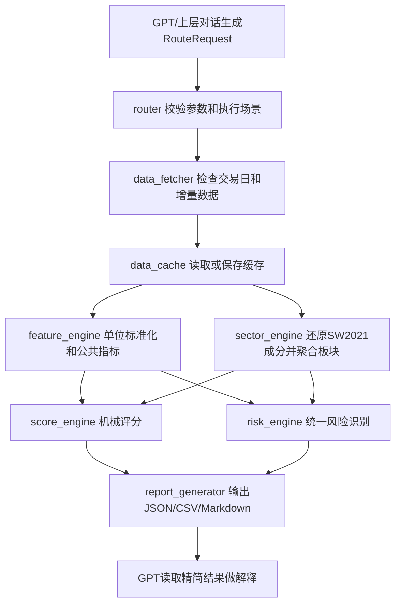

# 量化评分系统程序架构设计

架构版本：Architecture V1.1  
设计日期：2026-07-01  
依据：`reports/api_capability_audit.md`、已冻结的精简评分体系  
边界：本文件只做架构、数据口径和流程设计，不开发正式评分程序，不调整评分权重，不启动历史回测。

## 版本记录

| 版本 | 日期 | 修改说明 |
| --- | --- | --- |
| Architecture V1.0 | 2026-07-01 | 初始架构设计，确定模块、数据流、SW2021 L2 主口径、场景路由和输出格式。 |
| Architecture V1.1 | 2026-07-01 | 增加项目本地 `.venv` 正式运行方案；明确 CSV + SQLite 存储分工；修订 T-1 流通市值加权口径；固定板块持续性公共特征；调整 router 职责；明确用户上下文、数据单位、北交所/新股/小样本处理规则。 |

## 一、项目架构

建议在根项目下新增一个独立轻量 Python 包，复用现有 `股票策略研究室` 的数据缓存经验和脚本逻辑，但不直接把评分公式写进旧脚本。

```text
股票AI交易助手/
  .venv/
  config/
    scoring_architecture.yaml
    market_score.yaml
    sector_score.yaml
    leader_score.yaml
    stock_score.yaml
    risk_rules.yaml
    router_rules.yaml
  data/
    raw/tushare/
      daily/
      daily_basic/
      index_daily/
      adj_factor/
      suspend_d/
      stock_basic/
      trade_cal/
      index_classify/
      index_member/
      risk_events/
    processed/
      features/
      sectors/
      scores/
      reports/
      api_capability_audit.json
    sqlite/
      market_120d.sqlite
      market_250d.sqlite
    cache_manifest.json
  portfolio/
    account_baseline.yaml
  docs/
    scoring_system_architecture.md
  reports/
    api_capability_audit.md
    scoring/
  scoring_system/
    __init__.py
    cli.py
    data_fetcher.py
    data_cache.py
    feature_engine.py
    sector_engine.py
    score_engine.py
    risk_engine.py
    router.py
    report_generator.py
    backtest.py
    schemas.py
    utils/
      calendar.py
      code_mapper.py
      quality.py
      units.py
      io.py
  scripts/
    run_update.py
    run_score.py
    run_backtest.py
  run_update.bat
  run_score.bat
  run_backtest.bat
```

第一版可以先不移动 `股票策略研究室` 的既有脚本，只在新包里封装统一入口。等评分系统稳定后，再逐步把旧脚本里的成熟逻辑迁入 `scoring_system`。

## 二、模块职责

| 模块 | 职责 | 输入 | 输出 |
| --- | --- | --- | --- |
| `data_fetcher` | 调用 Tushare；读取 `TUSHARE_TOKEN`；判断交易日；首次全量和后续增量更新；接口失败分类。 | 日期范围、接口清单、股票/指数/板块代码 | 原始接口 DataFrame 和抓取状态 |
| `data_cache` | 管理本地缓存；原始单日接口缓存使用 CSV；合并后的120日、250日历史主表使用 SQLite；维护 `cache_manifest.json`；避免重复下载完整历史。 | DataFrame、数据类型、日期 | CSV 原始文件、SQLite 历史主表、缓存索引 |
| `feature_engine` | 在统一数据单位标准化后计算公共指标：1/3/5日收益、均线、成交额与5日均值比、收盘位置、乖离率、市场宽度、板块扩散度、相对强度。 | 已标准化行情、基础指标、板块映射 | 标准化特征表 |
| `sector_engine` | 管理申万 SW2021 L1/L2；根据 `in_date/out_date` 还原历史有效成分；聚合板块收益、成交额、扩散度；T日市值加权收益使用T-1日流通市值。 | `index_classify`、`index_member`、股票行情、T-1流通市值 | 板块日度特征、板块成分快照、覆盖率 |
| `score_engine` | 读取 YAML 配置，进行机械打分；只执行规则，不解释市场。 | 特征表、评分 YAML | 市场/板块/龙头/个股评分表 |
| `risk_engine` | 识别统一风险：放量下跌、冲高回落或放量滞涨、位置过热、板块和龙头同步破位、公司重大事件风险。 | 特征表、风险数据、风险 YAML | 风险标记、风险等级、缺失风险源 |
| `router` | 接收 GPT 或上层对话系统生成的结构化 `RouteRequest`；负责参数校验、场景执行、缺失字段判断和简单关键词兜底，不承担复杂自然语言理解。 | `RouteRequest`、简单文本兜底、可选上下文 | 校验后的标准化 `RouteRequest` |
| `report_generator` | 输出 JSON、CSV、Markdown 精简报告；不输出大段 AI 分析。 | 评分结果、风险标记、数据质量 | 报告文件和机器结果 |
| `backtest` | 后续验证 T 日评分与 T+1、T+3、T+5 表现；计算收益、超额收益、最大回撤。 | 历史评分、历史行情、基准 | 回测结果表和报告 |

`schemas.py` 负责定义统一字段名和结果结构，例如 `ScoreResult`、`DataQualityReport`、`RouteRequest`。`utils/units.py` 负责单位标准化，`utils/quality.py` 负责完整度和可信度计算。

## 三、数据流



日常运行顺序：

1. `run_update.bat` 更新交易日、指数、全市场日线、daily_basic、复权因子、停牌、申万成分、风险辅助数据。
2. `run_score.bat` 根据场景和日期读取缓存，计算特征和评分。
3. `run_backtest.bat` 后续用于历史验证，不在第一版评分上线前启用。

## 四、板块聚合口径

主板块口径固定为申万 SW2021 L2。L1 只用于大类汇总和报告分组，L2 用于正式板块排名和龙头筛选。

历史有效成分规则：

```text
有效成分 = index_member 中
  in_date <= trade_date
  且 (out_date 为空 或 out_date > trade_date)
```

必须按 T 日还原有效成分，不能使用未来成分，避免历史回测和历史评分泄漏未来信息。

板块每日同时计算两种收益：

| 指标 | 口径 | 用途 |
| --- | --- | --- |
| 流通市值加权收益 | `sum(T日收益 * T-1日流通市值) / sum(T-1日流通市值)`，只使用T日有有效行情且T-1日流通市值有效的成分股 | 板块相对市场强度 |
| 成分股等权收益 | 有效成分股当日收益的算术平均 | 反映板块普遍表现 |

市值加权覆盖率规则：

1. T日板块流通市值加权收益必须使用T-1日流通市值作为权重，避免使用当日收盘后的市值产生轻微前视。
2. 缺失T-1日流通市值的成分股不参与加权计算，并记录 `weighted_mv_coverage`。
3. `weighted_mv_coverage < 70%` 时，不输出正式市值加权结果；板块相对强度临时改用等权结果，同时降低数据可信度。
4. 缺失值不得填0参与任何板块收益计算。

其他板块指标：

| 指标 | 计算 |
| --- | --- |
| 板块扩散度 | 上涨有效成分股数量 / 当日有有效行情的板块成分股数量 |
| 板块成交额 | 有效成分股当日成交额汇总 |
| 板块成交占比 | 板块成交额 / 全市场成交额 |
| 板块3至5日持续性 | 固定由三个公共特征组成：最近5日跑赢全市场等权收益的天数、最近5日扩散度达到50%以上的天数、最近5日板块成交占比高于前一日的天数。具体打分权重以后写入 `sector_score.yaml`，不在 Python 代码中写死 |
| 龙头候选池 | L2 有效成分股中按相对板块强度、成交额排名、持续性和同步性筛选 |

当 `sw_daily` 无权限时，不影响第一版核心评分。板块历史涨跌幅和成交额以成分股聚合为主，平台板块指数仅作外部校验。

## 五、基准指数口径

个股主基准按交易板块映射：

| 股票范围 | 判定 | 主基准 |
| --- | --- | --- |
| 沪市主板 | `ts_code` 以 `.SH` 结尾且代码非 `688` 开头 | 上证指数 `000001.SH` |
| 深市主板 | `ts_code` 以 `.SZ` 结尾且代码非 `300` 开头 | 深证成指 `399001.SZ` |
| 创业板 | 股票代码以 `300` 开头 | 创业板指 `399006.SZ` |
| 科创板 | 股票代码以 `688` 开头 | 科创50 `000688.SH` |

板块跨市场，第一版采用统一主基准：

1. 优先使用全市场等权收益：由当日全市场 `daily.pct_chg` 计算，稳定、无需额外权限。
2. 辅助保存全市场成交额加权收益：可用 `daily.amount` 或流通市值权重近似，但第一版不作为主基准。
3. 若后续确认中证全指接口和缓存稳定，可增加中证全指作为辅助基准，不替换第一版口径。

建议保存两个基准字段：

| 字段 | 用途 |
| --- | --- |
| `primary_benchmark_return` | 评分主口径，第一版板块用全市场等权收益，个股用所属交易板块指数 |
| `secondary_benchmark_return` | 辅助观察，个股保留相对申万 L2 板块收益，板块可保留主要指数或中证全指 |

第一版避免基准过度复杂的原则：板块只对比全市场等权收益；个股只对比所属交易板块指数和所属申万 L2 板块；不按行业、风格、市值分层设置多套基准。

## 六、历史数据范围和缓存方案

正式评分前至少准备：

| 窗口 | 用途 |
| --- | --- |
| 最近120个交易日 | 均线、成交均值、热度、技术结构、位置分位 |
| 最近250个交易日 | 第一轮历史回测、T+1/T+3/T+5 验证 |

更新方式：首次全量抓取最近250个交易日；后续按交易日增量更新；每天只补缺失交易日，不重复下载完整历史；每个接口抓取后记录到 `data/cache_manifest.json`。

数据量估算：

| 项目 | 估算 |
| --- | --- |
| 全市场股票数 | 约5500只 |
| 250个交易日股票日线 | 约137.5万行 |
| 250个交易日 `daily_basic` | 约139.5万行 |
| 复权因子 | 约137.5万行 |
| 指数日线 | 少量，几千行以内 |
| 申万 L1/L2 分类和成分 | 小体量，定期更新 |
| 本地存储规模 | CSV 约300MB至800MB；SQLite 约200MB至500MB，取决于索引 |
| API调用次数 | 按日期抓取 `daily` 250次、`daily_basic` 250次、指数按代码或窗口抓取数十次、复权因子可能按股票分批，需节流 |
| 是否需要分日期抓取 | `daily`、`daily_basic` 推荐按日期抓取；`adj_factor` 推荐按股票分批或按接口限制分批 |

Architecture V1.1 存储方案：

| 数据 | 格式 | 原因 |
| --- | --- | --- |
| 原始单日接口缓存 | CSV | 简单、可直接查看、方便排错；与现有项目缓存方式一致 |
| 合并后的120日历史主表 | SQLite | 用 Python 标准库 `sqlite3`，不新增大型依赖；便于按日期、股票、板块查询 |
| 合并后的250日历史主表 | SQLite | 支持第一轮回测和T+1/T+3/T+5验证；避免大量CSV反复拼接 |
| 每日评分结果 | JSON、CSV、Markdown | JSON给GPT和程序读取，CSV用于排名和历史记录，Markdown给用户查看 |

SQLite 使用 Python 标准库，不新增大型依赖。Parquet 压缩更好，但依赖 `pyarrow`，本阶段不使用。原始CSV保留作为可追溯底稿，SQLite作为运行主表。

## 七、Python运行环境和启动脚本

审计确认当前可用的 Codex bundled Python：

```text
C:\Users\HUAWEI\.cache\codex-runtimes\codex-primary-runtime\dependencies\python\python.exe
```

该路径只作为临时开发解释器和兜底方案。正式方案必须增加项目本地 `.venv`，不得长期只依赖 Codex 缓存目录。系统 `python` 命令指向 Microsoft Store 占位程序，不作为项目启动入口。

统一启动脚本设计：

```bat
@echo off
setlocal
set PROJECT_ROOT=%~dp0
set VENV_PYTHON=%PROJECT_ROOT%.venv\Scripts\python.exe
set CODEX_PYTHON=C:\Users\HUAWEI\.cache\codex-runtimes\codex-primary-runtime\dependencies\python\python.exe

if exist "%VENV_PYTHON%" (
  set PYTHON_EXE=%VENV_PYTHON%
) else if exist "%CODEX_PYTHON%" (
  echo Warning: using temporary Codex bundled Python. Please create project .venv for formal runs.
  set PYTHON_EXE=%CODEX_PYTHON%
) else (
  echo ERROR: no usable Python found. Expected .venv or Codex bundled Python.
  exit /b 1
)

if "%TUSHARE_TOKEN%"=="" (
  echo TUSHARE_TOKEN is missing. Please set it in the environment.
  exit /b 1
)

"%PYTHON_EXE%" "%PROJECT_ROOT%scripts\run_update.py" %*
endlocal
```

建议文件：`run_update.bat`、`run_score.bat`、`run_backtest.bat`。三者均优先使用 `.venv`，缺失时再使用当前 Codex 解释器，两者都不可用时明确报错。

本地 `.venv` 建议由后续开发阶段创建并固定依赖版本；本次 V1.1 只修订架构，不创建虚拟环境、不安装依赖。

Token原则：Python 只读取环境变量 `TUSHARE_TOKEN`；任何日志只允许输出“存在/不存在、长度、掩码”，不得输出完整 Token；抓取和机械计算不消耗 Codex Token；Codex 只用于开发、修改和修复程序；GPT 只读取精简 JSON/Markdown 结果做解释。

## 八、统一数据标准

所有数据进入 `feature_engine` 前必须完成字段和单位标准化。标准化在 `schemas.py` 或统一数据标准模块中定义。

| 数据 | 标准单位/格式 | 说明 |
| --- | --- | --- |
| 价格 | 元/股 | `open/high/low/close/pre_close` 保留Tushare原始价格单位 |
| 成交量 | 股 | Tushare `daily.vol` 通常为手，进入特征层前统一转换为股，即 `vol * 100` |
| 成交额 | 元 | Tushare `daily.amount` 通常为千元，进入特征层前统一转换为元，即 `amount * 1000` |
| 总市值/流通市值 | 元 | Tushare `daily_basic.total_mv/circ_mv` 通常为万元，进入特征层前统一转换为元，即 `mv * 10000` |
| 换手率 | 小数 | Tushare `turnover_rate` 为百分数，进入特征层前统一转换为小数，例如 `3.5` 转为 `0.035` |
| 涨跌幅/收益率 | 小数 | Tushare `pct_chg` 为百分数，进入特征层前统一转换为小数，例如 `2.3` 转为 `0.023` |

标准化后，评分和风险模块只读取统一单位字段，不能混用Tushare原始单位。原始字段可保留在 raw cache 中用于追溯。

## 九、数据匹配和缺失处理

统一主键：`ts_code + trade_date`。板块表额外主键：`industry_code + trade_date`。

必须处理的情况：

| 情况 | 处理规则 |
| --- | --- |
| `daily` 和 `daily_basic` 行数不一致 | 左连接以 `daily` 为交易事实；缺失的 `daily_basic` 字段标记缺失，不填0 |
| 停牌 | `suspend_d` 标记；当日无行情不参与收益、扩散度、成交额评分 |
| 北交所股票 | 第一版暂时排除，原因是基准映射、流动性特征和板块口径需要单独校准 |
| 新上市 | 上市不足60个交易日标记为新股，不进入正常趋势核心排名；可输出观察项 |
| 缺失换手率或市值 | 不填0；相关子项不可评分或降权，记录缺失字段 |
| 成分股当日无行情 | 从板块当日有效行情分母中剔除，但记录成分覆盖率 |
| 复权因子缺失 | 短线可使用未复权价格，涉及长周期趋势时降低可信度 |
| 板块有效成分数量过少 | 有效成分股少于5只时，不输出正式评分 |
| 板块行情覆盖率过低 | 覆盖率低于70%时，不输出正式评分 |

数据质量规则：不允许把缺失值直接填0参与评分；每个模块输出 `data_quality`；关键字段缺失时降低数据可信度；数据可信度低于70%时，不输出正式评分，只输出“数据不足”；辅助字段缺失时，不阻止核心评分运行。

字段分层：

| 类别 | 字段 |
| --- | --- |
| 必需字段 | `ts_code`、`trade_date`、`open`、`high`、`low`、`close`、`pre_close`、`pct_chg`、`vol`、`amount`、`turnover_rate`、`total_mv`、`circ_mv`、`list_date`、`index_code`、`industry_name`、`con_code`、`in_date`、`out_date`、指数 `open/high/low/close/pct_chg/amount` |
| 可计算字段 | 1/3/5日收益、均线、成交额5日均值、成交额均值比、收盘位置、乖离率、全市场宽度、全市场等权收益、板块T-1流通市值加权收益、板块等权收益、板块扩散度、板块成交占比、相对市场强度、相对板块强度、板块内成交额排名、板块持续性三特征 |
| 辅助字段 | `volume_ratio`、`turnover_rate_f`、`adj_factor`、`suspend_type`、`forecast`、`express`、`stk_holdertrade`、`share_float`、公告标题、监管问询、平台人气、平台龙头标签、主力资金 |

## 十、使用场景路由

GPT 或上层对话系统负责把自然语言转换成结构化 `RouteRequest`。本地 `router` 主要负责参数校验、场景执行、缺失字段判断和简单关键词兜底，不承担复杂自然语言理解。

`RouteRequest` 标准结构：

```yaml
scenario: sector_discovery
as_of_date: 20260701
position_status: empty
time_horizon: short
stock_code: null
stock_name: null
sector_code: null
sector_name: null
stocks: []
sectors: []
position:
  cost: null
  shares: null
  holding_pct: null
need_user_input: false
missing_inputs: []
output_level: concise
```

场景设计：

| 场景 | 必要输入 | 标准流程 |
| --- | --- | --- |
| A 空仓寻找板块 | `as_of_date`，默认最近交易日 | 市场评分 -> 全部申万L2板块评分 -> 输出前2至3名板块、等级、优势、风险 |
| B 指定板块寻找龙头 | `sector_name` 或 `sector_code` | 检查板块是否达标 -> 获取有效成分股 -> 龙头评分 -> 输出情绪龙头、容量核心、趋势核心候选 |
| C 已筛选股票做执行评分 | `stock_code` 或可唯一识别的 `stock_name` | 个股执行评分 -> 风险识别 -> 输出等待确认、等待回调、过热警示等 |
| D 临时推荐股票 | `stock_code` 或可唯一识别的 `stock_name` | 市场简评分 -> 板块简评分 -> 板块地位 -> 个股执行评分 -> 统一风险 -> 独立综合结论 |
| E 持仓管理 | `stock_code`；成本和仓位优先从正式账户文件读取 | 更新市场、板块、龙头、个股状态 -> 结合成本仓位 -> 输出持有、减仓、退出或等待条件 |
| F 历史回测 | `stock_code` 或 `sector_code`，以及 `t_date` | 使用T日以前数据 -> 计算T日评分 -> 检查T+1/T+3/T+5表现 -> 输出收益、超额收益、最大回撤 |

用户上下文规则：

- 正式持仓、成本和仓位以 `portfolio/account_baseline.yaml` 为准。
- `user_context.json` 只保存最近场景、最近股票、默认周期和最近交易日。
- 临时上下文不得覆盖正式账户数据。
- 用户明确覆盖时，只更新允许写入的临时上下文字段。
- 对可默认的信息使用最近交易日，不追问。
- 只对影响流程正确性的关键信息追问，例如股票无法唯一匹配、回测缺少 T 日、持仓管理缺少正式账户数据且用户也未提供。

## 十一、评分配置方式

所有权重、阈值、等级必须放入 YAML，不写死在 Python 代码里。Python 只读配置并执行规则。Architecture V1.1 不调整冻结评分结构和权重。

公共元信息：

```yaml
version: "1.1"
effective_date: "2026-07-01"
change_reason: "Architecture V1.1; frozen scoring structure unchanged"
```

`config/market_score.yaml`、`leader_score.yaml`、`stock_score.yaml`、`risk_rules.yaml`、`router_rules.yaml` 继续保留 V1.0 的字段结构，只把版本元信息升级为 `1.1`。

`config/sector_score.yaml` 中板块持续性固定引用三个公共特征，权重以后再填：

```yaml
version: "1.1"
effective_date: "2026-07-01"
change_reason: "Architecture V1.1; persistence features fixed; weights unchanged"
sector_standard: SW2021_L2
items:
  persistence_3_5d:
    features:
      - outperform_market_days_5d
      - breadth_ge_50_days_5d
      - amount_share_up_days_5d
    thresholds: {}
    score_rules: []
```

## 十二、输出格式

程序机械输出必须简洁，不输出大段 AI 分析。

| 格式 | 用途 |
| --- | --- |
| JSON | GPT 读取、后续程序读取、自动化串联 |
| CSV | 排名、历史记录、回测 |
| Markdown | 用户查看的精简报告 |

JSON 至少包含：

```json
{
  "as_of_date": "20260701",
  "model_version": "1.1",
  "scenario": "sector_discovery",
  "data_quality": {
    "overall": 0.93,
    "market": 0.98,
    "sector": 0.91,
    "stock": null,
    "formal_score_allowed": true
  },
  "market_score": {},
  "sector_rankings": [],
  "leader_candidates": [],
  "stock_scores": [],
  "risk_flags": [],
  "missing_fields": [],
  "source_status": {
    "daily": "ok",
    "daily_basic": "ok",
    "index_member": "ok",
    "announcements": "aux_missing"
  }
}
```

CSV 输出建议：`market_score_YYYYMMDD.csv`、`sector_scores_YYYYMMDD.csv`、`leader_scores_YYYYMMDD.csv`、`stock_scores_YYYYMMDD.csv`、`risk_flags_YYYYMMDD.csv`。Markdown 报告只保留数据状态、市场结论、板块排名或个股评分、风险标记、缺失字段。

## 十三、开发顺序

1. 固化目录和配置文件，只放结构，不填完整阈值。
2. 创建项目本地 `.venv` 和统一启动脚本，Codex Python 只保留兜底。
3. 实现 `data_cache` 和 `data_fetcher` 的最小增量更新能力，原始单日接口缓存用CSV。
4. 建立 SQLite 120日/250日历史主表。
5. 实现 `feature_engine` 统一单位标准化和公共特征，不做评分解释。
6. 实现 `sector_engine` 的 SW2021 L2 历史有效成分聚合，市值加权使用T-1流通市值。
7. 实现 `score_engine` 读取 YAML 的机械评分框架。
8. 实现 `risk_engine` 的行情类风险标记。
9. 实现 `router` 对结构化 `RouteRequest` 的参数校验和场景执行。
10. 实现 `report_generator` 三种输出。
11. 用最近120日做稳定性检查。
12. 再准备250日数据做第一轮历史回测。

## 十四、已知风险

| 风险 | 影响 | 处理 |
| --- | --- | --- |
| 公告标题 `anns_d` 当前权限不足 | 公司重大事件风险不完整 | 降级为辅助外部核验，不阻塞核心评分 |
| 申万指数历史 `sw_daily` 当前权限不足 | 不能直接取板块指数行情 | 用成分股聚合计算板块收益和成交额 |
| `stk_factor` 当前权限不足 | 不能直接取复权行情一体字段 | 用 `daily + adj_factor` 自行计算 |
| 复权因子或市值缺失 | 长周期趋势和加权收益可信度下降 | 记录缺失，不填0；低于70%不出正式评分 |
| 成分股历史维护不当 | 历史回测未来数据泄漏 | 必须按 `in_date/out_date` 还原 T 日成分 |
| API限频或网络波动 | 更新失败或部分缺口 | 增量缓存、重试、状态记录 |
| 评分配置漂移 | 结果不可复现 | YAML 必须包含 `version`、`effective_date`、`change_reason` |
| 用户自然语言歧义 | 场景路由错误 | GPT/上层负责结构化，本地 router 只做校验和兜底 |
| 长期依赖 Codex 缓存 Python | 环境不可迁移 | 正式运行必须使用项目 `.venv`，Codex Python 只作临时兜底 |
| T日市值加权误用T日市值 | 产生轻微前视 | 固定使用T-1日流通市值，覆盖率不足70%时改用等权 |
| 北交所股票未覆盖 | 样本和基准不完整 | 第一版明确排除并记录原因，后续单独设计 |

## 十五、运行原则

1. Python 抓取和机械计算不消耗 Codex Token。
2. Codex 只用于开发、修改和修复程序。
3. GPT 只读取 JSON/CSV/Markdown 精简结果做解释。
4. 日常运行不得要求 Codex 重新阅读全部公式。
5. 公告和监管风险由 GPT 或外部检索补充，不阻塞核心评分。
6. 核心评分只使用能够稳定、重复、历史可追溯的数据。
7. Architecture V1.1 只修订架构，不开发正式评分程序，不调整冻结评分模块和权重。
